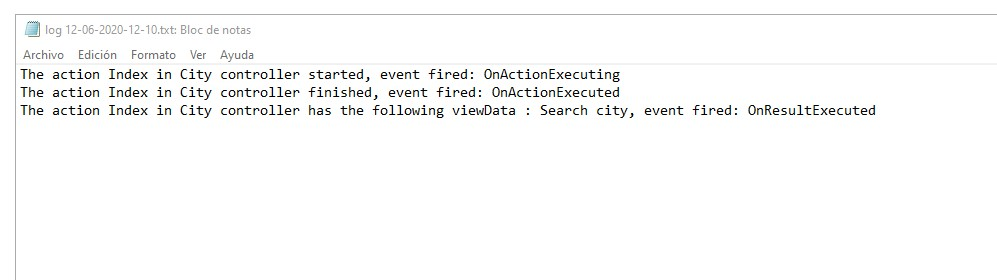

# Module 4: Developing Controllers

## Lab: Developing Controllers

1. **Nombres y apellidos:** Francisco Javier Moreno Quevedo
2. **Fecha:** 06/12/2020
3. **Resumen del Ejercicio:**  Añadir los componentes necesarios para hacer funcional la aplicacion de viajes 4/4
4. **Dificultad o problemas presentados y como se resolvieron:** Ninguna


- Ejercicio 4: Adding an Action Filter

  - Creamos la carpeta **Filters**

  - Creamos una clase **LogActionFilterAttribute** en esa carpeta

  - En ela clase **LogActionFilterAttribute**:

    - Añadimos los namespace que necesitamos
    - Creamos el constructor
    - Añadimos los metodos:
      - **OnActionExecuting** 
      - **OnActionExecuted**
      - **OnResultExecuted** 

  - EN el middleware

    - AÑadimos el namespace WorldJourney.Filters;

    - Añadimos el filtro a la colección de servicios:

      

      ```cs
             services.AddScoped<LogActionFilterAttribute>();
      ```

      

  - En el CityController Decoramos la accion Index con el filtro

    

    ```cs
           [ServiceFilter(typeof(LogActionFilterAttribute))]
    ```

    #### 




